# Cellcast SMS Developer Guide

This comprehensive guide covers all aspects of the Cellcast SMS Ruby gem, including advanced usage patterns, architecture details, API flows, and complete endpoint documentation.

## Table of Contents

1. [Architecture Overview](#architecture-overview)
2. [API Flow Diagrams](#api-flow-diagrams)
3. [Advanced Usage Examples](#advanced-usage-examples)
4. [Complete API Reference](#complete-api-reference)
5. [Error Handling & Retry Logic](#error-handling--retry-logic)
6. [Configuration Options](#configuration-options)
7. [Response Objects](#response-objects)
8. [Testing & Development](#testing--development)
9. [Security Considerations](#security-considerations)

## Architecture Overview

The Cellcast SMS gem follows a layered architecture designed for simplicity and extensibility:

```
┌─────────────────────────────────────────┐
│           Convenience Layer             │
│  (quick_send, broadcast, delivered?)    │
├─────────────────────────────────────────┤
│            API Modules Layer            │
│   (sms, incoming, sender_id, webhook)   │
├─────────────────────────────────────────┤
│           HTTP Client Layer             │
│        (request/response handling)      │
├─────────────────────────────────────────┤
│           Transport Layer               │
│         (Net::HTTP, SSL, retries)       │
└─────────────────────────────────────────┘
```

### Design Principles

1. **Zero Configuration Complexity**: Sensible defaults eliminate configuration overhead
2. **Developer Experience First**: Common operations require minimal code
3. **Failure Resilience**: Automatic retries with exponential backoff
4. **Clean Separation**: Clear boundaries between convenience and full API access

## API Flow Diagrams

### SMS Sending Flow


### Incoming Messages Flow


### Bidirectional Conversation Flow


### Error Recovery Flow

```mermaid
sequenceDiagram
    participant App as Your Application
    participant Client as Cellcast Client
    participant Retry as Retry Handler
    participant API as Cellcast API

    App->>Client: quick_send(...)
    Client->>Retry: execute_with_retry()
    
    Retry->>API: Attempt 1
    API-->>Retry: Network timeout
    
    Retry->>Retry: Wait 1 second
    Retry->>API: Attempt 2
    API-->>Retry: 500 Server Error
    
    Retry->>Retry: Wait 2 seconds
    Retry->>API: Attempt 3
    API-->>Retry: 200 Success
    
    Retry-->>Client: Success response
    Client-->>App: Return result
    
    Note over Retry: Exponential backoff: 1s → 2s → 4s (max 32s)
```



## Advanced Usage Examples

### Complete SMS Workflow

```ruby
require 'cellcast'

# Initialize client
client = Cellcast.sms(api_key: ENV['CELLCAST_API_KEY'])

begin
  # Send initial message
  response = client.quick_send(
    to: '+1234567890',
    message: 'Welcome! Reply STOP to unsubscribe.',
    from: 'YourBrand'
  )
  
  puts "Message sent: #{response.message_id}"
  puts "Cost: $#{response.cost}"
  
  # Monitor delivery
  sleep(5)
  if client.delivered?(message_id: response.message_id)
    puts "Message delivered successfully"
  else
    status = client.sms.get_status(message_id: response.message_id)
    puts "Status: #{status['status']}"
  end
  
  # Check for replies
  replies = client.incoming.get_replies(
    original_message_id: response.message_id,
    limit: 10
  )
  
  replies.each do |reply|
    puts "Reply from #{reply['from']}: #{reply['message']}"
    
    # Handle unsubscribe
    if reply['message'].upcase.include?('STOP')
      # Add to suppression list (your business logic)
      puts "Unsubscribe request from #{reply['from']}"
    end
  end

rescue Cellcast::SMS::ValidationError => e
  puts "Validation error: #{e.message}"
rescue Cellcast::SMS::RateLimitError => e
  puts "Rate limited. Retry after: #{e.retry_after} seconds"
rescue Cellcast::SMS::NetworkError => e
  puts "Network error. Message may have been sent. Check status."
end
```

### Bulk Messaging with Error Handling

```ruby
# Prepare recipient list
recipients = [
  '+1234567890',
  '+1987654321',
  '+1555000111'
]

# Send broadcast with error tracking
begin
  broadcast_response = client.broadcast(
    to: recipients,
    message: 'Important system maintenance scheduled tonight.',
    from: 'TechOps'
  )
  
  puts "Broadcast Results:"
  puts "  Successful: #{broadcast_response.successful_count}"
  puts "  Failed: #{broadcast_response.failed_count}"
  puts "  Total Cost: $#{broadcast_response.total_cost}"
  
  # Review individual failures
  broadcast_response.failures.each do |failure|
    puts "Failed to send to #{failure[:to]}: #{failure[:error]}"
  end
  
rescue Cellcast::SMS::APIError => e
  puts "API Error: #{e.message}"
  puts "Status: #{e.status_code}"
  puts "Response: #{e.response_body}"
end
```

### Advanced Incoming Message Management

```ruby
# Process incoming messages with comprehensive filtering
incoming_params = {
  limit: 50,
  unread_only: true,
  date_from: (Date.today - 7).to_s,  # Last 7 days
  sender_id: 'YourBrand'
}

incoming_messages = client.incoming.list_incoming(incoming_params)

# Categorize and process messages
replies = []
new_conversations = []

incoming_messages.each do |message|
  if message['is_reply']
    replies << message
  else
    new_conversations << message
  end
end

# Process replies
unless replies.empty?
  puts "Processing #{replies.length} replies..."
  
  replies.each do |reply|
    original_msg = client.sms.get_status(
      message_id: reply['original_message_id']
    )
    
    puts "Reply to '#{original_msg['message']}': #{reply['message']}"
  end
end

# Process new conversations
unless new_conversations.empty?
  puts "Processing #{new_conversations.length} new conversations..."
  
  new_conversations.each do |message|
    # Auto-respond to new conversations
    auto_response = client.quick_send(
      to: message['from'],
      message: 'Thanks for contacting us! We will respond shortly.',
      from: 'Support'
    )
    
    puts "Auto-response sent: #{auto_response.message_id}"
  end
end

# Mark all as read
message_ids = incoming_messages.map { |msg| msg['message_id'] }
client.incoming.mark_as_read(message_ids: message_ids)
```

### Webhook Integration Example

```ruby
# Configure comprehensive webhook
webhook_config = {
  url: 'https://yourapp.com/webhooks/cellcast',
  events: [
    'sms.sent',      # Message sent successfully
    'sms.delivered', # Message delivered to recipient
    'sms.failed',    # Message failed to send
    'sms.received',  # New incoming message
    'sms.reply'      # Reply to a sent message
  ],
  secret: ENV['WEBHOOK_SECRET']
}

client.webhook.configure_webhook(webhook_config)

# Test webhook with each event type
webhook_config[:events].each do |event_type|
  test_result = client.webhook.test_webhook(event_type: event_type)
  puts "#{event_type} test: #{test_result['status']}"
end

# Monitor webhook delivery
logs = client.webhook.get_delivery_logs(limit: 100)
failed_deliveries = logs.select { |log| log['status'] == 'failed' }

# Retry failed deliveries
failed_deliveries.each do |delivery|
  retry_result = client.webhook.retry_delivery(
    delivery_id: delivery['delivery_id']
  )
  puts "Retry #{delivery['delivery_id']}: #{retry_result['status']}"
end
```

## Complete API Reference

### SMS Module (`client.sms`)

#### Send Single Message
```ruby
response = client.sms.send_message(
  to: '+1234567890',           # Required: recipient phone number
  message: 'Hello World!',     # Required: message content (1-1600 chars)
  sender_id: 'YourBrand'       # Optional: sender ID
)
```

**Response Format:**
```json
{
  "message_id": "msg_123456789",
  "status": "sent",
  "cost": 0.05,
  "parts": 1,
  "created_at": "2024-01-15T10:30:00Z"
}
```

#### Send Bulk Messages
```ruby
messages = [
  { to: '+1234567890', message: 'Hello User 1!' },
  { to: '+0987654321', message: 'Hello User 2!', sender_id: 'Custom' }
]

response = client.sms.send_bulk(
  messages: messages,          # Required: array of message objects
  global_sender_id: 'Brand'    # Optional: default sender for all messages
)
```

**Response Format:**
```json
{
  "batch_id": "batch_789012345",
  "total_messages": 2,
  "successful": 2,
  "failed": 0,
  "total_cost": 0.10,
  "messages": [
    {
      "message_id": "msg_123456789",
      "to": "+1234567890",
      "status": "sent",
      "cost": 0.05
    }
  ]
}
```

#### Get Message Status
```ruby
status = client.sms.get_status(message_id: 'msg_123456789')
```

**Response Format:**
```json
{
  "message_id": "msg_123456789",
  "status": "delivered",
  "sent_at": "2024-01-15T10:30:00Z",
  "delivered_at": "2024-01-15T10:30:15Z",
  "cost": 0.05,
  "parts": 1,
  "to": "+1234567890",
  "from": "YourBrand"
}
```

**Status Values:**
- `queued`: Message accepted and queued for sending
- `sent`: Message sent to carrier
- `delivered`: Message delivered to recipient
- `failed`: Message failed to send
- `expired`: Message expired before delivery

#### Get Delivery Report
```ruby
report = client.sms.get_delivery_report(message_id: 'msg_123456789')
```

#### List Sent Messages
```ruby
messages = client.sms.list_messages(
  limit: 50,                   # Optional: 1-100, default 30
  offset: 0,                   # Optional: pagination offset
  date_from: '2024-01-01',     # Optional: YYYY-MM-DD format
  date_to: '2024-01-31',       # Optional: YYYY-MM-DD format
  status: 'delivered'          # Optional: filter by status
)
```

#### Delete Message (Cancel Scheduled SMS)
```ruby
# Delete a scheduled message before it's sent
response = client.sms.delete_message(message_id: 'msg_123456789')
```

**Response Format:**
```json
{
  "app_type": "web",
  "app_version": "1.0",
  "status": true,
  "message": "Message deleted successfully",
  "data": {
    "message_id": "msg_123456789",
    "deleted": true,
    "deleted_at": "2024-01-15T10:30:00Z"
  }
}
```

**Important Notes:**
- This endpoint is primarily used to cancel scheduled messages that haven't been sent yet
- Once a message has been sent or delivered, it typically cannot be deleted
- The official API endpoint is named "Delete Sent SMS Message" but is mainly for scheduled messages
- Use the convenience method `client.cancel_message(message_id: 'msg_123')` for simpler access

**Error Scenarios:**
- **404 Not Found**: Message doesn't exist or was already deleted
- **400 Bad Request**: Message has already been sent and cannot be deleted  
- **500 Server Error**: Internal error during deletion

**Convenience Method:**
```ruby
# Simpler interface for canceling scheduled messages
response = client.cancel_message(message_id: 'msg_123456789')
# Returns a wrapped Response object with success?, message, and data access
```

### Incoming SMS Module (`client.incoming`)

#### List Incoming Messages
```ruby
incoming = client.incoming.list_incoming(
  limit: 50,                   # Optional: 1-100, default 30
  offset: 0,                   # Optional: pagination offset
  unread_only: true,           # Optional: filter unread messages
  date_from: '2024-01-01',     # Optional: YYYY-MM-DD format
  date_to: '2024-01-31',       # Optional: YYYY-MM-DD format
  sender_id: 'YourBrand'       # Optional: filter by sender ID
)
```

**Response Format:**
```json
{
  "messages": [
    {
      "message_id": "incoming_123456",
      "from": "+1234567890",
      "to": "YourBrand",
      "message": "Hello!",
      "received_at": "2024-01-15T10:30:00Z",
      "is_reply": false,
      "original_message_id": null,
      "read": false
    }
  ],
  "total": 1,
  "limit": 50,
  "offset": 0
}
```

#### Get Specific Incoming Message
```ruby
message = client.incoming.get_incoming_message(
  message_id: 'incoming_123456'
)
```

#### Mark Messages as Read
```ruby
client.incoming.mark_as_read(
  message_ids: ['incoming_123456', 'incoming_789012']  # Array of message IDs (1-100)
)
```

#### Get Replies to Sent Message
```ruby
replies = client.incoming.get_replies(
  original_message_id: 'msg_123456789',  # Required: ID of original sent message
  limit: 10,                             # Optional: 1-100, default 30
  offset: 0                              # Optional: pagination offset
)
```

### Sender ID Module (`client.sender_id`)

#### Register Business Name
```ruby
response = client.sender_id.register_business_name(
  business_name: 'Your Company Ltd',     # Required: business name (max 50 chars)
  business_registration: 'REG123456',    # Required: registration number
  contact_info: {                        # Required: contact information
    email: 'contact@yourcompany.com',
    phone: '+1234567890',
    address: '123 Business St, City'     # Optional
  }
)
```

#### Register Custom Number
```ruby
response = client.sender_id.register_custom_number(
  phone_number: '+1234567890',           # Required: phone number in E.164 format
  purpose: 'Customer notifications'      # Required: purpose description
)
```

#### Verify Custom Number
```ruby
response = client.sender_id.verify_custom_number(
  phone_number: '+1234567890',           # Required: registered phone number
  verification_code: '123456'            # Required: verification code from SMS
)
```

#### List Sender IDs
```ruby
sender_ids = client.sender_id.list_sender_ids(
  type: 'business_name',                 # Optional: 'business_name' or 'custom_number'
  status: 'approved'                     # Optional: 'pending', 'approved', 'rejected'
)
```

### Webhook Module (`client.webhook`)

#### Configure Webhook
```ruby
response = client.webhook.configure_webhook(
  url: 'https://yourapp.com/webhooks',   # Required: webhook endpoint URL
  events: [                              # Required: array of event types
    'sms.sent',
    'sms.delivered', 
    'sms.failed',
    'sms.received',
    'sms.reply'
  ],
  secret: 'your-webhook-secret'          # Optional: for signature verification
)
```

**Webhook Event Payloads:**

SMS Sent Event (`sms.sent`):
```json
{
  "event": "sms.sent",
  "timestamp": "2024-01-15T10:30:00Z",
  "data": {
    "message_id": "msg_123456789",
    "to": "+1234567890",
    "from": "YourBrand",
    "message": "Hello World!",
    "status": "sent"
  }
}
```

SMS Received Event (`sms.received`):
```json
{
  "event": "sms.received",
  "timestamp": "2024-01-15T10:35:00Z",
  "data": {
    "message_id": "incoming_123456",
    "from": "+1234567890",
    "to": "YourBrand",
    "message": "Hi there!",
    "received_at": "2024-01-15T10:35:00Z",
    "is_reply": false
  }
}
```

#### Test Webhook
```ruby
response = client.webhook.test_webhook(
  event_type: 'sms.sent'                 # Required: event type to test
)
```

#### Get Webhook Configuration
```ruby
config = client.webhook.get_webhook_config
```

#### Delete Webhook
```ruby
response = client.webhook.delete_webhook
```

#### Get Delivery Logs
```ruby
logs = client.webhook.get_delivery_logs(
  limit: 100,                            # Optional: 1-100, default 30
  offset: 0                              # Optional: pagination offset
)
```

#### Retry Failed Delivery
```ruby
response = client.webhook.retry_delivery(
  delivery_id: 'delivery_123456'         # Required: failed delivery ID
)
```

### Token Module (`client.token`)

#### Verify Token
```ruby
token_info = client.token.verify_token
```

**Response Format:**
```json
{
  "valid": true,
  "token_id": "token_123456",
  "permissions": ["sms.send", "sms.receive", "webhook.manage"],
  "expires_at": "2024-12-31T23:59:59Z"
}
```

#### Get Token Information
```ruby
info = client.token.get_token_info
```

#### Get Usage Statistics
```ruby
stats = client.token.get_usage_stats(
  period: 'monthly'                      # Optional: 'daily', 'weekly', 'monthly'
)
```

**Response Format:**
```json
{
  "period": "monthly",
  "messages_sent": 1250,
  "messages_received": 85,
  "total_cost": 62.50,
  "webhook_deliveries": 1335,
  "api_calls": 2847
}
```

## Error Handling & Retry Logic

### Error Class Hierarchy

```
Cellcast::SMS::Error
├── AuthenticationError      # 401 responses, invalid API key
├── ValidationError         # Parameter validation failures
├── APIError               # General API errors (4xx, 5xx)
│   ├── RateLimitError    # 429 responses, includes retry_after
│   └── ServerError       # 5xx responses
└── NetworkError           # Network-related errors
    ├── TimeoutError      # Request timeouts
    ├── ConnectionError   # Connection failures
    └── SSLError         # SSL/TLS errors
```

### Retry Strategy

The gem uses a fixed retry strategy with exponential backoff:

- **Maximum Retries**: 3 attempts
- **Backoff Timing**: 1s → 2s → 4s (capped at 32 seconds)
- **Retry Conditions**:
  - Rate limit errors (429) - uses `Retry-After` header when available
  - Server errors (5xx)
  - Network errors (timeouts, connection failures)
- **No Retry Conditions**:
  - Authentication errors (401)
  - Validation errors (400, 422)
  - Client errors (other 4xx)

### Error Handling Examples

```ruby
begin
  response = client.quick_send(
    to: '+1234567890',
    message: 'Test message'
  )
rescue Cellcast::SMS::AuthenticationError => e
  # API key is invalid or expired
  puts "Authentication failed: #{e.message}"
  # Action: Check API key, contact support if needed
  
rescue Cellcast::SMS::ValidationError => e
  # Invalid parameters
  puts "Validation error: #{e.message}"
  # Error messages include guidance:
  # "Phone number must be in international format (e.g., +1234567890)"
  
rescue Cellcast::SMS::RateLimitError => e
  # Rate limit exceeded
  puts "Rate limited: #{e.message}"
  if e.retry_after
    puts "Retry after: #{e.retry_after} seconds"
    sleep(e.retry_after)
    # Retry the request
  end
  
rescue Cellcast::SMS::NetworkError => e
  # Network connectivity issues
  puts "Network error: #{e.message}"
  # The gem already retried 3 times with exponential backoff
  # Consider checking network connectivity or trying again later
  
rescue Cellcast::SMS::ServerError => e
  # Cellcast API server error
  puts "Server error: #{e.message}"
  puts "Status: #{e.status_code}"
  # The gem already retried 3 times
  # Check Cellcast status page or contact support
  
rescue Cellcast::SMS::APIError => e
  # Other API errors
  puts "API error: #{e.message}"
  puts "Status: #{e.status_code}"
  puts "Response: #{e.response_body}"
end
```

### Timeout Configuration

```ruby
# Configure timeouts (only essential options)
client = Cellcast.sms(
  api_key: 'your-api-key',
  open_timeout: 30,    # Connection timeout (seconds)
  read_timeout: 60,    # Read timeout (seconds)
  logger: Logger.new(STDOUT)  # Optional debug logging
)
```

## Response Objects

### SMSResponse

Returned by `quick_send()` and other convenience methods:

```ruby
response = client.quick_send(to: '+1234567890', message: 'Hello!')

# Access response data
response.message_id     # => "msg_123456789"
response.status         # => "sent"
response.cost          # => 0.05
response.parts         # => 1
response.created_at    # => "2024-01-15T10:30:00Z"

# Boolean checks
response.success?      # => true
response.failed?       # => false

# Raw data access
response.data          # => Hash of all response data
```

### BroadcastResponse

Returned by `broadcast()` method:

```ruby
broadcast = client.broadcast(
  to: ['+1111111111', '+2222222222'],
  message: 'Announcement'
)

# Aggregated statistics
broadcast.successful_count   # => 2
broadcast.failed_count      # => 0
broadcast.total_cost        # => 0.10

# Individual results
broadcast.successes         # => Array of successful sends
broadcast.failures          # => Array of failed sends with error details

# Batch information
broadcast.batch_id          # => "batch_789012345"
broadcast.total_messages    # => 2
```

### IncomingMessagesList

Returned by `unread_messages()` and similar convenience methods:

```ruby
unread = client.unread_messages(limit: 10)

# Access messages
unread.items.each do |message|
  puts message.from          # Sender phone number
  puts message.message       # Message content
  puts message.received_at   # Timestamp
  puts message.is_reply?     # Boolean - is this a reply?
end

# Pagination information
unread.total              # => Total message count
unread.limit              # => Current limit
unread.offset             # => Current offset
unread.has_more?          # => Boolean - more messages available?
```

## Testing & Development

### Sandbox Mode for Cost-Free Testing

The gem includes a comprehensive sandbox mode that allows you to test your SMS integration without making live API calls or incurring costs. This is perfect for development, testing, and CI/CD pipelines.

#### Enabling Sandbox Mode

```ruby
# Enable sandbox mode (opt-in only, disabled by default)
config = Cellcast::SMS::Configuration.new
config.sandbox_mode = true

client = Cellcast.sms(api_key: 'test-key', config: config)

# All methods work identically, but no live calls are made
response = client.quick_send(to: '+1234567890', message: 'Test message')
puts response.success? # => true (realistic mock response)
```

#### Special Test Numbers

Inspired by Stripe's test cards and Twilio's magic test numbers, the sandbox mode provides special phone numbers that trigger specific behaviors:

```ruby
'+15550000000' # → Always succeeds (queued status)
'+15550000001' # → Always fails (failed status)  
'+15550000002' # → Rate limited (throws RateLimitError)
'+15550000003' # → Invalid number (throws ValidationError)
'+15550000004' # → Insufficient credits (throws APIError)
```

Any other phone number defaults to successful behavior.

#### Special Test Message IDs

For testing the delete message functionality, sandbox mode provides special message IDs that trigger different behaviors:

```ruby
'sandbox_message_123'      # → Delete succeeds
'sandbox_notfound_123'     # → Message not found (404 error)
'sandbox_already_sent_123' # → Already sent, cannot delete (400 error)
'sandbox_fail_123'         # → Delete operation fails (500 error)
```

**Usage Examples:**
```ruby
# Test successful deletion
response = client.sms.delete_message(message_id: 'sandbox_message_123')
puts response['status'] # => true

# Test message not found scenario
begin
  client.sms.delete_message(message_id: 'sandbox_notfound_123')
rescue Cellcast::SMS::APIError => e
  puts "Error: #{e.message}" # => "Message not found"
  puts "Status: #{e.status_code}" # => 404
end

# Test already sent message scenario
begin
  client.cancel_message(message_id: 'sandbox_already_sent_456')
rescue Cellcast::SMS::APIError => e
  puts "Cannot delete: #{e.message}" # => "Cannot delete already sent message"
  puts "Status: #{e.status_code}" # => 400
end
```

Any other message ID defaults to successful deletion behavior.

#### Testing Error Scenarios

The special test numbers make it easy to test error handling:

```ruby
# Test rate limiting scenarios
begin
  client.quick_send(to: '+15550000002', message: 'Test')
rescue Cellcast::SMS::RateLimitError => e
  puts "Handle rate limiting: retry after #{e.retry_after} seconds"
end

# Test validation errors
begin
  client.quick_send(to: '+15550000003', message: 'Test')
rescue Cellcast::SMS::ValidationError => e
  puts "Validation error: #{e.message}"
end

# Test API errors (insufficient credits)
begin
  client.quick_send(to: '+15550000004', message: 'Test')
rescue Cellcast::SMS::APIError => e
  puts "API error: #{e.message}, Status: #{e.status_code}"
end
```

#### Comprehensive Sandbox Coverage

The sandbox mode supports all API endpoints with realistic responses:

```ruby
# SMS sending
response = client.quick_send(to: '+15550000000', message: 'Test')
puts "Message ID: #{response.message_id}" # sandbox_1234567890_5678

# Bulk sending
broadcast = client.broadcast(
  to: ['+15550000000', '+15550000001', '+15551234567'],
  message: 'Test broadcast'
)
puts "Success: #{broadcast.successful_count}, Failed: #{broadcast.failed_count}"

# Message status checking
status = client.check_status(message_id: 'test_delivered_msg')
puts status.delivered? # => true

# Incoming messages simulation
unread = client.unread_messages
unread.items.each { |msg| puts "#{msg.from}: #{msg.message}" }

# Webhook configuration
webhook = client.setup_webhook(url: 'https://example.com/webhook')
puts webhook.success? # => true

# All other endpoints work similarly
```

#### Sandbox Response Format

Sandbox responses match the real API structure exactly:

```ruby
# Real API response structure is replicated
{
  "id" => "sandbox_1641390000_1234",
  "message_id" => "sandbox_1641390000_1234", 
  "to" => "+15550000000",
  "status" => "queued",
  "cost" => 0.05,
  "parts" => 1,
  "created_at" => "2024-01-15T10:30:00Z"
}
```

#### Benefits of Sandbox Mode

- **💰 Zero Cost**: No charges for testing
- **🎯 Predictable**: Consistent responses for reliable tests
- **🧪 Error Testing**: Easy error scenario simulation
- **⚡ Fast**: Instant responses without network delays
- **🔒 Safe**: Perfect for CI/CD pipelines
- **📚 Developer Friendly**: Matches real API exactly

#### Example: Complete Test Suite

```ruby
# Test successful sending
def test_successful_send
  config = Cellcast::SMS::Configuration.new
  config.sandbox_mode = true
  client = Cellcast.sms(api_key: 'test', config: config)
  
  response = client.quick_send(to: '+15550000000', message: 'Test')
  assert response.success?
  assert_equal 'queued', response.status
  assert response.message_id.start_with?('sandbox_')
end

# Test error handling
def test_error_scenarios
  # Rate limiting
  assert_raises(Cellcast::SMS::RateLimitError) do
    client.quick_send(to: '+15550000002', message: 'Test')
  end
  
  # Invalid number
  assert_raises(Cellcast::SMS::ValidationError) do  
    client.quick_send(to: '+15550000003', message: 'Test')
  end
  
  # API error
  assert_raises(Cellcast::SMS::APIError) do
    client.quick_send(to: '+15550000004', message: 'Test')
  end
end
```

For a complete sandbox demonstration, see `examples/sandbox_mode.rb`.

### Running Tests

```bash
# Run all tests
rake test

# Run specific test file
ruby test/test_sms_client.rb

# Run with verbose output
rake test TESTOPTS="-v"
```

### Test Coverage

The gem includes comprehensive test coverage for:

- **Error Handling**: All error types and retry scenarios
- **Response Objects**: Structured response functionality
- **Convenience Methods**: Developer-friendly API operations
- **Validation**: Input parameter validation
- **Network Failures**: Timeout and connection error handling

### Development Setup

```bash
# Clone repository
git clone https://github.com/timburgan/cellcast-sms.git
cd cellcast-sms

# Install dependencies
bundle install

# Run tests
rake test

# Build gem
gem build cellcast-sms.gemspec

# Install locally
gem install cellcast-sms-*.gem
```

### API Testing

Use the provided test scenarios in `TEST_SCENARIOS.md` for comprehensive testing:

```ruby
# Test with invalid API key
client = Cellcast.sms(api_key: 'invalid-key')

begin
  client.quick_send(to: '+1234567890', message: 'Test')
rescue Cellcast::SMS::AuthenticationError => e
  puts "Expected authentication error: #{e.message}"
end

# Test rate limiting simulation
# (Rate limiting behavior can be tested with high-volume sends)

# Test network failure recovery
# (Network failures are handled automatically by retry logic)
```

## Security Considerations

### API Key Management

```ruby
# ✅ Good: Use environment variables
client = Cellcast.sms(api_key: ENV['CELLCAST_API_KEY'])

# ❌ Bad: Hardcoded API keys
client = Cellcast.sms(api_key: 'your-actual-api-key')
```

### Webhook Security

```ruby
# Configure webhook with secret for signature verification
client.webhook.configure_webhook(
  url: 'https://yourapp.com/webhooks',
  events: ['sms.received'],
  secret: ENV['WEBHOOK_SECRET']  # Use strong, random secret
)

# In your webhook handler:
def verify_webhook_signature(payload, signature, secret)
  expected = OpenSSL::HMAC.hexdigest('SHA256', secret, payload)
  Rack::Utils.secure_compare("sha256=#{expected}", signature)
end
```

### Input Validation

The gem automatically validates all inputs before making API calls:

```ruby
# Phone number validation
client.quick_send(to: 'invalid-phone', message: 'Test')
# Raises: ValidationError with guidance on correct format

# Message length validation  
client.quick_send(to: '+1234567890', message: 'x' * 1601)
# Raises: ValidationError with maximum length information
```

### Logging Considerations

```ruby
# Configure logging to avoid sensitive data exposure
logger = Logger.new(STDOUT)
logger.level = Logger::INFO  # Avoid DEBUG in production

client = Cellcast.sms(
  api_key: ENV['CELLCAST_API_KEY'],
  logger: logger
)

# API keys and message content are automatically masked in logs
```

## Performance Optimization

### Bulk Operations

```ruby
# ✅ Efficient: Use broadcast for multiple recipients
client.broadcast(
  to: ['+1111111111', '+2222222222', '+3333333333'],
  message: 'Bulk message'
)

# ❌ Inefficient: Individual calls
phones.each do |phone|
  client.quick_send(to: phone, message: 'Individual message')
end
```

### Webhook vs Polling

```ruby
# ✅ Efficient: Use webhooks for real-time processing
client.setup_webhook(url: 'https://yourapp.com/webhooks')

# ❌ Less efficient: Frequent polling
loop do
  sleep(30)
  unread = client.unread_messages
  # Process messages...
end
```

### Connection Reuse

The HTTP client automatically reuses connections for efficiency. No special configuration needed.

---

For additional support or questions, refer to the [main documentation](README.md) or contact [Cellcast support](https://cellcast.com/support).