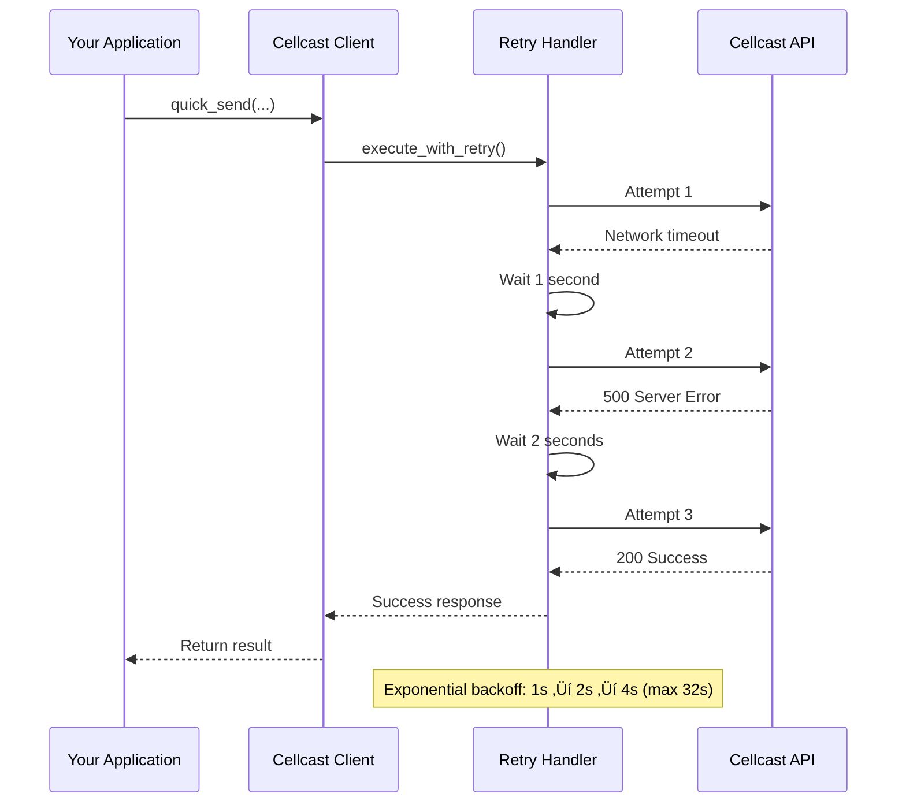

# Cellcast SMS

> **Note**: This is an unofficial gem that wraps the [official Cellcast API](https://developer.cellcast.com). I built this for me own use to make my life easier.

A Ruby gem for the Cellcast API focused on SMS sending, account management, and sender ID registration. Simple, reliable SMS delivery with a developer-friendly interface.

## Features

- **Send SMS**: Individual messages and bulk broadcasts
- **Account Management**: Check balance and usage reports
- **Sender ID Management**: Register business names and custom numbers
- **Zero Configuration**: Sensible defaults with automatic retries and error handling
- **Developer Friendly**: Structured response objects and helpful error messages  
- **Ruby 3.3+**: Uses only Ruby standard library, no external dependencies

## Quick Start

### Installation

Add to your Gemfile:

```ruby
gem 'cellcast-sms'
```

Then run:
```bash
bundle install
```

### Basic Usage

```ruby
require 'cellcast'

# Create client with your API key
client = Cellcast.sms(api_key: 'your-api-key')

# Send a message
response = client.quick_send(
  to: '+1234567890',
  message: 'Hello from Cellcast!',
  from: 'YourBrand'
)

if response['status']
  message_id = response.dig('data', 'queueResponse', 0, 'MessageId')
  puts "Message sent! ID: #{message_id}"
end

# Send to multiple recipients
broadcast = client.broadcast(
  to: ['+1234567890', '+0987654321'],
  message: 'Important announcement!'
)

puts "Sent to #{broadcast.dig('data', 'totalValidContact')} recipients"

# Check account balance
balance = client.balance
puts "Current balance: $#{balance.dig('data', 'balance') || 'Unknown'}"

# Get usage statistics
usage = client.usage_report
puts "Messages sent this month: #{usage.dig('data', 'messages_sent') || 'Unknown'}"

# Register a business name for sender ID
registration_response = client.sender_id.register_business_name(
  business_name: 'Your Company Ltd',
  business_registration: 'REG123456',
  contact_info: {
    email: 'contact@yourcompany.com',
    phone: '+1234567890'
  }
)
puts "Registration status: #{registration_response['status'] ? 'Success' : 'Failed'}"
```

## Error Handling

The gem includes automatic retries and helpful error messages:

```ruby
begin
  response = client.quick_send(to: '+1234567890', message: 'Hello!')
rescue Cellcast::SMS::ValidationError => e
  puts "Validation error: #{e.message}"
  # Example: "Phone number must be in international format (e.g., +1234567890)"
rescue Cellcast::SMS::RateLimitError => e
  puts "Rate limited. Retry after: #{e.retry_after} seconds"
  puts "Attempted URL: #{e.requested_url}"
rescue Cellcast::SMS::NetworkError => e
  puts "Network error: #{e.message}"
  # Gem automatically retried 3 times with exponential backoff
rescue Cellcast::SMS::APIError => e
  puts "API error: #{e.message}"
  puts "Attempted URL: #{e.requested_url}"
end
```

## Advanced Usage

The gem provides two levels of access:

**Convenience Methods** (shown above) - Perfect for common use cases  
**Full API Access** - Complete control over all parameters:

```ruby
# Direct API access for advanced customization
response = client.sms.send_message(
  to: '+1234567890',
  message: 'Hello!',
  sender_id: 'YourBrand'
)

# All methods now return raw API responses as Hash objects
puts "Status: #{response['status']}"
puts "Message ID: #{response.dig('data', 'queueResponse', 0, 'MessageId')}"

# Cancel a scheduled message
cancel_response = client.cancel_message(message_id: 'msg_123456789')
puts "Cancelled: #{cancel_response['status']}"

# Account operations
balance = client.account.get_account_balance
usage = client.account.get_usage_report

# Sender ID management
registration = client.sender_id.register_business_name(
  business_name: 'Your Company Ltd',
  business_registration: 'REG123456',
  contact_info: { email: 'contact@yourcompany.com', phone: '+1234567890' }
)
puts "Registration: #{registration['message']}"

client.sender_id.register_custom_number(
  phone_number: '+1234567890',
  purpose: 'Customer notifications'
)
```

## Developer Guide

### Table of Contents

1. [Architecture Overview](#architecture-overview)
2. [API Flow Diagrams](#api-flow-diagrams)
3. [Advanced Usage Examples](#advanced-usage-examples)
4. [Complete API Reference](#complete-api-reference)
5. [Error Handling & Retry Logic](#error-handling--retry-logic)
6. [Configuration Options](#configuration-options)
7. [Response Objects](#response-objects)
8. [Testing & Development](#testing--development)
9. [Security Considerations](#security-considerations)

### Architecture Overview

The Cellcast SMS gem follows a layered architecture designed for simplicity and extensibility:

```
┌─────────────────────────────────────────┐
│           Convenience Layer             │
│  (quick_send, broadcast, delivered?)    │
├─────────────────────────────────────────┤
│            API Modules Layer            │
│   (sms, incoming, sender_id, webhook)   │
├─────────────────────────────────────────┤
│           HTTP Client Layer             │
│        (request/response handling)      │
├─────────────────────────────────────────┤
│           Transport Layer               │
│         (Net::HTTP, SSL, retries)       │
└─────────────────────────────────────────┘
```

#### Design Principles

1. **Zero Configuration Complexity**: Sensible defaults eliminate configuration overhead
2. **Developer Experience First**: Common operations require minimal code
3. **Failure Resilience**: Automatic retries with exponential backoff
4. **Clean Separation**: Clear boundaries between convenience and full API access

### API Flow Diagrams

#### SMS Sending Flow


#### Account Balance Flow


#### Error Recovery Flow



### Advanced Usage Examples

#### Complete SMS Workflow

```ruby
require 'cellcast'

# Initialize client
client = Cellcast.sms(api_key: ENV['CELLCAST_API_KEY'])

begin
  # Send initial message
  response = client.quick_send(
    to: '+1234567890',
    message: 'Welcome! Your account has been created.',
    from: 'YourBrand'
  )
  
  if response['status']
    message_id = response.dig('data', 'queueResponse', 0, 'MessageId')
    puts "Message sent: #{message_id}"
  end
  
  # Check account balance after sending
  balance = client.balance
  puts "Remaining balance: $#{balance.dig('data', 'balance') || 'Unknown'}"
  
  # Get usage statistics
  usage = client.usage_report
  puts "Messages sent this month: #{usage.dig('data', 'messages_sent') || 'Unknown'}"

rescue Cellcast::SMS::ValidationError => e
  puts "Validation error: #{e.message}"
rescue Cellcast::SMS::RateLimitError => e
  puts "Rate limited. Retry after: #{e.retry_after} seconds"
  puts "Attempted URL: #{e.requested_url}"
rescue Cellcast::SMS::NetworkError => e
  puts "Network error. Message may have been sent. Check account balance."
  puts "Attempted URL: #{e.requested_url}"
rescue Cellcast::SMS::APIError => e
  puts "API error: #{e.message}"
  puts "Attempted URL: #{e.requested_url}"
end
```

#### Bulk Messaging with Error Handling

```ruby
# Prepare recipient list
recipients = [
  '+1234567890',
  '+1987654321',
  '+1555000111'
]

# Send broadcast with error tracking
begin
  broadcast_response = client.broadcast(
    to: recipients,
    message: 'Important system maintenance scheduled tonight.',
    from: 'TechOps'
  )
  
  puts "Broadcast Results:"
  puts "  Successful: #{broadcast_response.dig('data', 'totalValidContact') || 0}"
  puts "  Failed: #{broadcast_response.dig('data', 'totalInvalidContact') || 0}"
  
  # Check remaining balance after bulk send
  balance = client.balance
  puts "Remaining balance: $#{balance.dig('data', 'balance') || 'Unknown'}"
  
rescue Cellcast::SMS::APIError => e
  puts "API Error: #{e.message}"
  puts "Status: #{e.status_code}"
  puts "Attempted URL: #{e.requested_url}"
  puts "Response: #{e.response_body}"
end
```

#### Sender ID Management Example

```ruby
# Register a business name for sender ID
begin
  business_response = client.sender_id.register_business_name(
    business_name: 'Your Company Ltd',
    business_registration: 'REG123456',
    contact_info: {
      email: 'contact@yourcompany.com',
      phone: '+1234567890',
      address: '123 Business St, City'
    }
  )
  
  puts "Business name registration: #{business_response['status']}"
  puts "Application ID: #{business_response['application_id']}"
  
rescue Cellcast::SMS::APIError => e
  puts "Registration failed: #{e.message}"
  puts "Attempted URL: #{e.requested_url}"
end

# Register a custom phone number
begin
  number_response = client.sender_id.register_custom_number(
    phone_number: '+1234567890',
    purpose: 'Customer notifications and support'
  )
  
  puts "Custom number registration: #{number_response['status']}"
  puts "Verification required: #{number_response['verification_required']}"
  
  # If verification is required, verify with code
  if number_response['verification_required']
    verification_response = client.sender_id.verify_custom_number(
      phone_number: '+1234567890',
      verification_code: '123456'  # Code received via SMS
    )
    
    puts "Verification result: #{verification_response['verified']}"
  end
  
rescue Cellcast::SMS::APIError => e
  puts "Number registration failed: #{e.message}"
  puts "Attempted URL: #{e.requested_url}"
end
```

### Complete API Reference

#### SMS Module (`client.sms`)

##### Send Single Message
```ruby
response = client.sms.send_message(
  to: '+1234567890',           # Required: recipient phone number
  message: 'Hello World!',     # Required: message content (1-1600 chars)
  sender_id: 'YourBrand'       # Optional: sender ID
)
```

**Response Format:**
```json
{
  "app_type": "web",
  "app_version": "1.0",
  "status": true,
  "message": "Request is being processed",
  "data": {
    "queueResponse": [
      {
        "Contact": "+1234567890",
        "MessageId": "msg_123456",
        "Result": "Message added to queue."
      }
    ],
    "totalValidContact": 1,
    "totalInvalidContact": 0
  },
  "error": {}
}
```

##### Send Bulk Messages
```ruby
messages = [
  { to: '+1234567890', message: 'Hello User 1!' },
  { to: '+0987654321', message: 'Hello User 2!', sender_id: 'Custom' }
]

response = client.sms.send_bulk(
  messages: messages,          # Required: array of message objects
  global_sender_id: 'Brand'    # Optional: default sender for all messages
)
```

##### Delete Message (Cancel Scheduled SMS)
```ruby
# Delete a scheduled message before it's sent
response = client.sms.delete_message(message_id: 'msg_123456789')
```

**Response Format:**
```json
{
  "app_type": "web",
  "app_version": "1.0",
  "status": true,
  "message": "Message deleted successfully",
  "data": {
    "message_id": "msg_123456789",
    "deleted": true,
    "deleted_at": "2024-01-15T10:30:00Z"
  }
}
```

**Important Notes:**
- This endpoint is primarily used to cancel scheduled messages that haven't been sent yet
- Once a message has been sent or delivered, it typically cannot be deleted
- The official API endpoint is named "Delete Sent SMS Message" but is mainly for scheduled messages
- Use the convenience method `client.cancel_message(message_id: 'msg_123')` for simpler access

**Error Scenarios:**
- **404 Not Found**: Message doesn't exist or was already deleted
- **400 Bad Request**: Message has already been sent and cannot be deleted  
- **500 Server Error**: Internal error during deletion

**Convenience Method:**
```ruby
# Simpler interface for canceling scheduled messages
response = client.cancel_message(message_id: 'msg_123456789')
# Returns raw API response with status, message, and data access
```

#### Account Module (`client.account`)

##### Get Account Balance
```ruby
balance = client.account.get_account_balance
```

**Response Format:**
```json
{
  "app_type": "web",
  "app_version": "1.0",
  "status": true,
  "message": "Account balance retrieved successfully",
  "data": {
    "balance": 25.50,
    "currency": "USD",
    "last_updated": "2024-01-15T10:30:00Z"
  }
}
```

##### Get Usage Report
```ruby
usage = client.account.get_usage_report
```

**Response Format:**
```json
{
  "app_type": "web",
  "app_version": "1.0",
  "status": true,
  "message": "Usage report retrieved successfully",
  "data": {
    "period": "monthly",
    "messages_sent": 1250,
    "total_cost": 62.50,
    "last_updated": "2024-01-15T10:30:00Z"
  }
}
```

#### Sender ID Module (`client.sender_id`)

##### Register Business Name
```ruby
response = client.sender_id.register_business_name(
  business_name: 'Your Company Ltd',     # Required: business name (max 50 chars)
  business_registration: 'REG123456',    # Required: registration number
  contact_info: {                        # Required: contact information
    email: 'contact@yourcompany.com',
    phone: '+1234567890',
    address: '123 Business St, City'     # Optional
  }
)
```

##### Register Custom Number
```ruby
response = client.sender_id.register_custom_number(
  phone_number: '+1234567890',           # Required: phone number in E.164 format
  purpose: 'Customer notifications'      # Required: purpose description
)
```

##### Verify Custom Number
```ruby
response = client.sender_id.verify_custom_number(
  phone_number: '+1234567890',           # Required: registered phone number
  verification_code: '123456'            # Required: verification code from SMS
)
```

#### Token Module (`client.token`)

##### Verify Token
```ruby
token_info = client.token.verify_token
```

**Response Format:**
```json
{
  "app_type": "web",
  "app_version": "1.0",
  "status": true,
  "message": "Token verified successfully",
  "data": {
    "valid": true,
    "token_id": "token_123456",
    "permissions": ["sms.send", "sms.receive", "webhook.manage"],
    "expires_at": "2024-12-31T23:59:59Z"
  }
}
```

### Error Handling & Retry Logic

#### Error Class Hierarchy

```
Cellcast::SMS::Error
├── AuthenticationError      # 401 responses, invalid API key
├── ValidationError         # Parameter validation failures
├── APIError               # General API errors (4xx, 5xx)
│   ├── RateLimitError    # 429 responses, includes retry_after
│   └── ServerError       # 5xx responses
└── NetworkError           # Network-related errors
    ├── TimeoutError      # Request timeouts
    ├── ConnectionError   # Connection failures
    └── SSLError         # SSL/TLS errors
```

#### Retry Strategy

The gem uses a fixed retry strategy with exponential backoff:

- **Maximum Retries**: 3 attempts
- **Backoff Timing**: 1s → 2s → 4s (capped at 32 seconds)
- **Retry Conditions**:
  - Rate limit errors (429) - uses `Retry-After` header when available
  - Server errors (5xx)
  - Network errors (timeouts, connection failures)
- **No Retry Conditions**:
  - Authentication errors (401)
  - Validation errors (400, 422)
  - Client errors (other 4xx)

#### Error Handling Examples

```ruby
begin
  response = client.quick_send(
    to: '+1234567890',
    message: 'Test message'
  )
rescue Cellcast::SMS::AuthenticationError => e
  # API key is invalid or expired
  puts "Authentication failed: #{e.message}"
  # Action: Check API key, contact support if needed
  
rescue Cellcast::SMS::ValidationError => e
  # Invalid parameters
  puts "Validation error: #{e.message}"
  # Error messages include guidance:
  # "Phone number must be in international format (e.g., +1234567890)"
  
rescue Cellcast::SMS::RateLimitError => e
  # Rate limit exceeded
  puts "Rate limited: #{e.message}"
  if e.retry_after
    puts "Retry after: #{e.retry_after} seconds"
    sleep(e.retry_after)
    # Retry the request
  end
  
rescue Cellcast::SMS::NetworkError => e
  # Network connectivity issues
  puts "Network error: #{e.message}"
  # The gem already retried 3 times with exponential backoff
  # Consider checking network connectivity or trying again later
  
rescue Cellcast::SMS::ServerError => e
  # Cellcast API server error
  puts "Server error: #{e.message}"
  puts "Status: #{e.status_code}"
  # The gem already retried 3 times
  # Check Cellcast status page or contact support
  
rescue Cellcast::SMS::APIError => e
  # Other API errors
  puts "API error: #{e.message}"
  puts "Status: #{e.status_code}"
  puts "Response: #{e.response_body}"
end
```

### Configuration Options

#### Timeout Configuration

```ruby
# Configure timeouts (only essential options)
client = Cellcast.sms(
  api_key: 'your-api-key',
  open_timeout: 30,    # Connection timeout (seconds)
  read_timeout: 60,    # Read timeout (seconds)
  logger: Logger.new(STDOUT)  # Optional debug logging
)
```

### Response Objects

All methods now return raw API response `Hash` objects with the official Cellcast API structure:

```ruby
response = client.quick_send(to: '+1234567890', message: 'Hello!')

# Access response data directly from the Hash
puts "Status: #{response['status']}"
puts "Message: #{response['message']}"

# Navigate nested data structures
if response['status']
  message_id = response.dig('data', 'queueResponse', 0, 'MessageId')
  puts "Message ID: #{message_id}"
end

# Check for errors
if response['error'] && !response['error'].empty?
  puts "API Error: #{response['error']}"
end
```

### Testing & Development

#### Sandbox Mode for Cost-Free Testing

The gem includes a comprehensive sandbox mode that allows you to test your SMS integration without making live API calls or incurring costs. This is perfect for development, testing, and CI/CD pipelines.

##### Enabling Sandbox Mode

```ruby
# Enable sandbox mode (opt-in only, disabled by default)
config = Cellcast::SMS::Configuration.new
config.sandbox_mode = true

client = Cellcast.sms(api_key: 'test-key', config: config)

# All methods work identically, but no live calls are made
response = client.quick_send(to: '+1234567890', message: 'Test message')
puts response['status'] # => true (realistic mock response)
```

##### Special Test Numbers

Inspired by Stripe's test cards and Twilio's magic test numbers, the sandbox mode provides special phone numbers that trigger specific behaviors:

```ruby
'+15550000000' # → Always succeeds (queued status)
'+15550000001' # → Always fails (failed status)  
'+15550000002' # → Rate limited (throws RateLimitError)
'+15550000003' # → Invalid number (throws ValidationError)
'+15550000004' # → Insufficient credits (throws APIError)
```

Any other phone number defaults to successful behavior.

##### Special Test Message IDs

For testing the delete message functionality, sandbox mode provides special message IDs that trigger different behaviors:

```ruby
'sandbox_message_123'      # → Delete succeeds
'sandbox_notfound_123'     # → Message not found (404 error)
'sandbox_already_sent_123' # → Already sent, cannot delete (400 error)
'sandbox_fail_123'         # → Delete operation fails (500 error)
```

**Usage Examples:**
```ruby
# Test successful deletion
response = client.sms.delete_message(message_id: 'sandbox_message_123')
puts response['status'] # => true

# Test message not found scenario
begin
  client.sms.delete_message(message_id: 'sandbox_notfound_123')
rescue Cellcast::SMS::APIError => e
  puts "Error: #{e.message}" # => "Message not found"
  puts "Status: #{e.status_code}" # => 404
end

# Test already sent message scenario
begin
  client.cancel_message(message_id: 'sandbox_already_sent_456')
rescue Cellcast::SMS::APIError => e
  puts "Cannot delete: #{e.message}" # => "Cannot delete already sent message"
  puts "Status: #{e.status_code}" # => 400
end
```

Any other message ID defaults to successful deletion behavior.

##### Testing Error Scenarios

The special test numbers make it easy to test error handling:

```ruby
# Test rate limiting scenarios
begin
  client.quick_send(to: '+15550000002', message: 'Test')
rescue Cellcast::SMS::RateLimitError => e
  puts "Handle rate limiting: retry after #{e.retry_after} seconds"
end

# Test validation errors
begin
  client.quick_send(to: '+15550000003', message: 'Test')
rescue Cellcast::SMS::ValidationError => e
  puts "Validation error: #{e.message}"
end

# Test API errors (insufficient credits)
begin
  client.quick_send(to: '+15550000004', message: 'Test')
rescue Cellcast::SMS::APIError => e
  puts "API error: #{e.message}, Status: #{e.status_code}"
end
```

##### Comprehensive Sandbox Coverage

The sandbox mode supports all API endpoints with realistic responses:

```ruby
# SMS sending
response = client.quick_send(to: '+15550000000', message: 'Test')
puts "Message ID: #{response.dig('data', 'queueResponse', 0, 'MessageId')}"

# Bulk sending
broadcast = client.broadcast(
  to: ['+15550000000', '+15550000001', '+15551234567'],
  message: 'Test broadcast'
)
puts "Success: #{broadcast.dig('data', 'totalValidContact')}, Failed: #{broadcast.dig('data', 'totalInvalidContact')}"

# Account operations
balance = client.balance
puts "Balance: $#{balance.dig('data', 'balance')}"

usage = client.usage_report
puts "Messages sent: #{usage.dig('data', 'messages_sent')}"

# Sender ID operations
business_registration = client.sender_id.register_business_name(
  business_name: 'Test Company',
  business_registration: 'REG123',
  contact_info: { email: 'test@example.com', phone: '+15550000000' }
)
puts "Registration: #{business_registration['status']}"

# All other endpoints work similarly
```

##### Sandbox Response Format

Sandbox responses match the real API structure exactly:

```ruby
# Real API response structure is replicated
{
  "app_type" => "web",
  "app_version" => "1.0",
  "status" => true,
  "message" => "Request is being processed",
  "data" => {
    "queueResponse" => [
      {
        "Contact" => "+15550000000",
        "MessageId" => "sandbox_1641390000_1234",
        "Result" => "Message added to queue."
      }
    ],
    "totalValidContact" => 1,
    "totalInvalidContact" => 0
  },
  "error" => {}
}
```

##### Benefits of Sandbox Mode

- **💰 Zero Cost**: No charges for testing
- **🎯 Predictable**: Consistent responses for reliable tests
- **🧪 Error Testing**: Easy error scenario simulation
- **⚡ Fast**: Instant responses without network delays
- **🔒 Safe**: Perfect for CI/CD pipelines
- **📚 Developer Friendly**: Matches real API exactly

##### Example: Complete Test Suite

```ruby
# Test successful sending
def test_successful_send
  config = Cellcast::SMS::Configuration.new
  config.sandbox_mode = true
  client = Cellcast.sms(api_key: 'test', config: config)
  
  response = client.quick_send(to: '+15550000000', message: 'Test')
  assert response['status']
  assert_equal 'Request is being processed', response['message']
  assert response.dig('data', 'queueResponse', 0, 'MessageId').start_with?('sandbox_')
end

# Test error handling
def test_error_scenarios
  # Rate limiting
  assert_raises(Cellcast::SMS::RateLimitError) do
    client.quick_send(to: '+15550000002', message: 'Test')
  end
  
  # Invalid number
  assert_raises(Cellcast::SMS::ValidationError) do  
    client.quick_send(to: '+15550000003', message: 'Test')
  end
  
  # API error
  assert_raises(Cellcast::SMS::APIError) do
    client.quick_send(to: '+15550000004', message: 'Test')
  end
end
```

For a complete sandbox demonstration, see `examples/sandbox_mode.rb`.

#### Running Tests

```bash
# Run all tests
rake test

# Run specific test file
ruby test/test_sms_client.rb

# Run with verbose output
rake test TESTOPTS="-v"
```

#### Test Coverage

The gem includes comprehensive test coverage for:

- **Error Handling**: All error types and retry scenarios
- **Response Objects**: Raw response functionality
- **Convenience Methods**: Developer-friendly API operations
- **Validation**: Input parameter validation
- **Network Failures**: Timeout and connection error handling

#### Development Setup

```bash
# Clone repository
git clone https://github.com/timburgan/cellcast-sms.git
cd cellcast-sms

# Install dependencies
bundle install

# Run tests
rake test

# Build gem
gem build cellcast-sms.gemspec

# Install locally
gem install cellcast-sms-*.gem
```

#### API Testing

Use the provided test scenarios for comprehensive testing:

```ruby
# Test with invalid API key
client = Cellcast.sms(api_key: 'invalid-key')

begin
  client.quick_send(to: '+1234567890', message: 'Test')
rescue Cellcast::SMS::AuthenticationError => e
  puts "Expected authentication error: #{e.message}"
end

# Test rate limiting simulation
# (Rate limiting behavior can be tested with high-volume sends)

# Test network failure recovery
# (Network failures are handled automatically by retry logic)
```

### Security Considerations

#### API Key Management

```ruby
# ✅ Good: Use environment variables
client = Cellcast.sms(api_key: ENV['CELLCAST_API_KEY'])

# ❌ Bad: Hardcoded API keys
client = Cellcast.sms(api_key: 'your-actual-api-key')
```

#### Rate Limiting Awareness

```ruby
# Handle rate limiting gracefully in high-volume scenarios
begin
  response = client.broadcast(to: large_recipient_list, message: 'Announcement')
rescue Cellcast::SMS::RateLimitError => e
  puts "Rate limited. Retry after: #{e.retry_after} seconds"
  puts "Attempted URL: #{e.requested_url}"
  sleep(e.retry_after)
  # Retry the operation
end
```

#### Input Validation

The gem automatically validates all inputs before making API calls:

```ruby
# Phone number validation
client.quick_send(to: 'invalid-phone', message: 'Test')
# Raises: ValidationError with guidance on correct format

# Message length validation  
client.quick_send(to: '+1234567890', message: 'x' * 1601)
# Raises: ValidationError with maximum length information
```

#### Logging Considerations

```ruby
# Configure logging to avoid sensitive data exposure
logger = Logger.new(STDOUT)
logger.level = Logger::INFO  # Avoid DEBUG in production

client = Cellcast.sms(
  api_key: ENV['CELLCAST_API_KEY'],
  logger: logger
)

# API keys and message content are automatically masked in logs
```

### Performance Optimization

#### Bulk Operations

```ruby
# ✅ Efficient: Use broadcast for multiple recipients
client.broadcast(
  to: ['+1111111111', '+2222222222', '+3333333333'],
  message: 'Bulk message'
)

# ❌ Inefficient: Individual calls
phones.each do |phone|
  client.quick_send(to: phone, message: 'Individual message')
end
```

#### Account Balance Monitoring

```ruby
# ✅ Efficient: Check balance periodically for cost control
balance = client.balance
if balance.dig('data', 'balance').to_f < 10.0
  puts "Warning: Low balance - $#{balance.dig('data', 'balance')}"
  # Send alert or top up account
end

# ✅ Efficient: Monitor usage patterns
usage = client.usage_report
messages_sent = usage.dig('data', 'messages_sent') || 0
total_cost = usage.dig('data', 'total_cost') || 0

if messages_sent > 0
  puts "Usage this month: #{messages_sent} messages"
  puts "Average cost per message: $#{total_cost.to_f / messages_sent}"
end
```

#### Connection Reuse

The HTTP client automatically reuses connections for efficiency. No special configuration needed.

## Documentation

- **[Changelog](CHANGELOG.md)** - Version history and changes
- Official API documentation is at https://developer.cellcast.com

## Requirements

- Ruby 3.3.0 or higher

## Contributing

Bug reports and pull requests are welcome on GitHub at https://github.com/timburgan/cellcast-sms.

## License

Available under the [MIT License](LICENSE.txt).